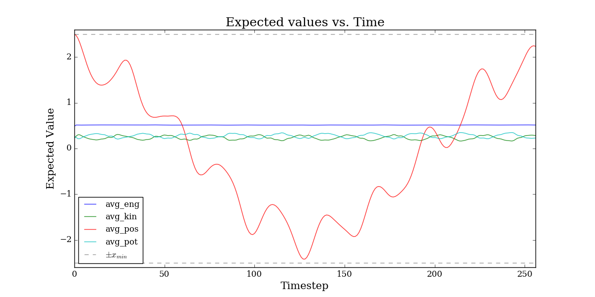

### Description 

Simulate the tunneling time of a particle in a double harmonic potential well.

### Usage

Run the code:
	
	make

Run a new simulation:
	
	rm simulateTunneling; python remove.py; make

Make plots and animation:
	
	python plot.py <output>

where options for `<output>` are `expected`, `wave_prob`, `period`, `fourier`, and `animation`.

### Example

Plot several samples of the period:

	make
	python plot.py period

Tunneling annimation:

	python plot.py wave_prob
	python plot.py animation

Expected values of dynamical variables vs. time:

	python plot.py expected

